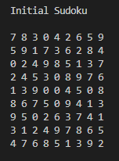
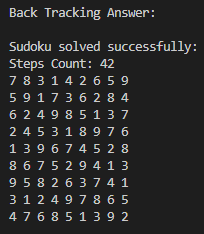
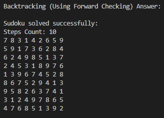

<h1>Sudoku Solver AI</h1>

This project aims to create and solve <i>Sudoku</i> as a <i>Constraint Satisfaction Problem</i>. 

Sudoku is a logic-based, combinatorial number-placement puzzle. The objective is to fill a 9×9 grid with digits so that each column, each row, and each of the nine 3×3 subgrids that compose the grid (also called "boxes", "blocks", or "regions") contain all of the digits from 1 to 9. The puzzle setter provides a partially completed grid, which for a well-posed puzzle has a single solution.

## :star2: About the Project

### :camera: Screenshots

  
  
  

## :toolbox: Getting Started

### :bangbang: Prerequisites

- Install python <a href="https://www.python.org/downloads/"> Here </a>

### :scroll: Code of Conduct

In this project, there are two different algorithms used to solve the Sudoku: <i>Simple Backtracking</i> and <i>Backtracking with Forward-Checking</i>.

Here's a breakdown of the code function by function:

<b>generate_sudoku</b>: This function generates a Sudoku puzzle. It first fills the diagonal boxes of the grid with random numbers, then solves the grid, and finally removes a random number of elements from the grid to create the puzzle. The sudoku is generated and ready to be solved.

<b>fill_diagonal</b>: This function fills the diagonal boxes of the Sudoku grid.

<b>fill_box</b>: This function fills a 3x3 box with random values.

<b>is_safe</b>: This function checks if it's safe to place a number in a particular position. It checks if the number is already used in the same row, column, or 3x3 box.

<b>used_in_row</b>: This function checks if a number is used in a row.

<b>used_in_column</b>: This function checks if a number is used in a column.

<b>used_in_box</b>: This function checks if a number is used in a 3x3 box.

<b>find_unassigned_location</b>: This function finds an unassigned location in the grid.

<b>remove_elements</b>: This function removes a certain number of elements from the grid.

<b>solve_sudoku</b>: This function solves the Sudoku puzzle using backtracking. It finds an unassigned location in the grid, then for each value from 1 to 9, it checks if it's safe to place the value at that location. If it is, it places the value and recursively tries to solve the rest of the grid. If it can't solve the grid with that value, it backtracks and tries the next value.

<b>display_grid</b>: This function displays the Sudoku grid.

<b>solve_sudoku_forward_checking</b>: This function solves the Sudoku puzzle using forward checking that is a common filtering. It first creates domains for each cell in the grid, which are the possible values that can be placed in that cell. Then it finds an unassigned location in the grid and for each value in the domain of that location, it checks if it's a valid assignment. If it is, it assigns the value and recursively tries to solve the rest of the grid. If it can't solve the grid with that value, it removes the value from the domain and tries the next value.

<b>initializing_grid</b>: This function generates and displays the initial Sudoku grid.

<b>backtracking_answer</b>: This function solves the Sudoku grid using backtracking and displays the result.

<b>backtracking_forward_checking_answer</b>: This function solves the Sudoku grid using backtracking with forward checking and displays the result.

Main: The main part of the script generates a Sudoku puzzle, makes two copies of it, and then solves it using both simple backtracking and backtracking with forward checking. It prints the initial Sudoku grid, the solved grid, and the number of steps taken to solve the grid for both methods.

## :warning: License

Distributed under the MIT License.

This code is provided by <a href="https://github.com/ErfanXH">ErfanXH</a> and all rights are reserved.

Project Link: [https://github.com/ErfanXH/Sudoku-AI](https://github.com/ErfanXH/Sudoku-AI)
